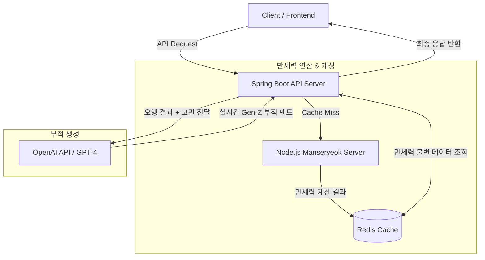

# 🍀 내운내뽑 (My Luck My Pick)

> **"내 운세와 부적은 내가 직접 뽑는다!"**  
> Gen-Z(Z세대) 타겟의 위트 있고 뻔뻔한 폰 배경화면/소장용 라이프스타일 행운 부적 서비스

<br/>

## 📌 프로젝트 소개
'내운내뽑'은 사주 오행 연산 결과와 OpenAI GPT-4를 결합하여, 사용자의 고민과 사주 기운에 딱 맞는 **위트 있는 행운 부적 멘트**를 생성해 주는 백엔드 중심 API 서비스입니다.  
전통 사주의 무속적인 느낌을 배제하고, 현시대 Z세대가 좋아할 만한 텍스트 기반 행운 힌트 카피를 제공합니다.

<br/>

## 🛠️ 기술 스택 (Tech Stack)

### Backend
- **Java 17**, **Spring Boot 3.2**
- **Spring Data Redis**: 만세력 연산 정적 데이터 캐싱
- **Spring WebClient**: 외부 Node.js 만세력 API 및 OpenAI API 비동기 통신
- **Springdoc OpenAPI (v2.8.5)**: Swagger 기반 API 문서 자동화

### External Services
- **Node.js (Manseryeok API)**: 사주 만세력(연/월/일/시주) 연산 서버
- **OpenAI API (GPT-4)**: 고민 카테고리별 맞춤형 부적 멘트 생성

<br/>

## 🏗️ 시스템 아키텍처 (Architecture)
```text
[ Client ] 
    │
    ▼
[ Spring Boot API Server ] ──(Cache Miss)──▶ [ Node.js Manseryeok Server ]
    │                                              │ (만세력 계산)
    ├───────▶ [ Redis Cache ] ◀────────────────────┘
    │          (만세력 불변 데이터 캐싱)
    │
    └───────▶ [ OpenAI API ] 
               (실시간 Gen-Z 부적 멘트 생성)
```            
---

### 2. Mermaid.js 방식 (GitHub에서 다이어그램으로 자동 렌더링 🎨)

GitHub README에서 예쁜 박스와 화살표 다이어그램으로 자동 변환해 주는 방식입니다.

## 🏗️ 시스템 아키텍처 (System Architecture)


### 💡 README.md 적용 예시

README.md의 **시스템 아키텍처** 위치에 아래처럼 포함시키시면 포트폴리오 완성도가 훨씬 높아집니다.

## 🏗️ 시스템 아키텍처 (System Architecture)

'내운내뽑' 백엔드는 정적 데이터(사주 만세력 연산)의 성능 최적화를 위한 **Redis 캐싱 레이어**와, 동적 콘텐츠 생성(Gen-Z 부적 멘트)을 위한 **OpenAI 연동 레이어**로 분리되어 설계되었습니다.

```text
[ Client ] 
    │
    ▼
[ Spring Boot API Server ] ──(Cache Miss)──▶ [ Node.js Manseryeok Server ]
    │                                              │ (만세력 계산)
    ├───────▶ [ Redis Cache ] ◀────────────────────┘
    │          (만세력 불변 데이터 캐싱)
    │
    └───────▶ [ OpenAI API ] 
               (실시간 Gen-Z 부적 멘트 생성)
```
